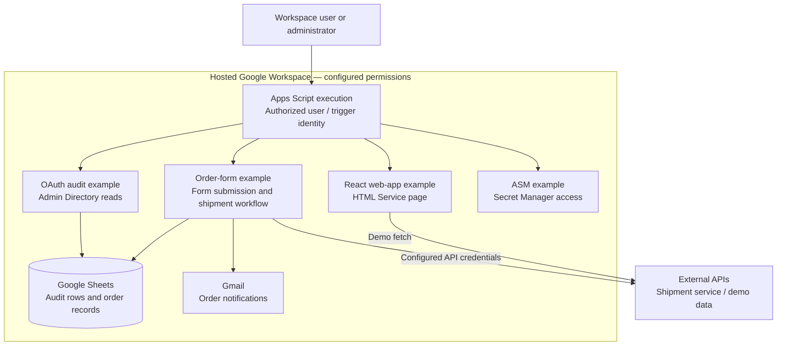

# Workspace Utilities architecture

Independent Google Apps Script examples for Workspace administration, forms and small web interfaces.

This repository is a collection, not one deployed application. Examples require administrator setup, consent and permissions. No live deployment was checked.

[PNG image](overview.png) · [Editable Mermaid source](overview.mmd)

Arrows show requests or data movement; replies return along the same route. Boxes grouped as local or hosted show where work runs. Authentication boundaries are labeled where present.

## Component roles

| Component | Role | Learn more |
| --- | --- | --- |
| Apps Script | Runs each installed example under configured execution identity and consent. | [Reference](https://developers.google.com/apps-script) |
| OAuth audit | Reads Workspace users and granted application scopes; writes an audit sheet. | [Reference](../../userOAuthAudit.js) |
| Order-form example | Processes form submissions, shipment API calls, order sheets and email notifications. | [Reference](../../YubicoOrderForm/README.md) |
| React example | Serves a small page through HTML Service, including a public demo-data fetch. | [Reference](../../AppsScriptReactApp/README.md) |
| ASM example | Illustrates access to Google Secret Manager using the effective user’s OAuth token. | [Reference](../../ASM/README.md) |

## Boundaries and limitations

These paths are independent examples; installing one does not activate the others. Workspace permissions, web-app access settings and external API authorization are separate boundaries. Deployment access settings are not fully defined by this collection. Configure placeholders and review code before use; no tenant identifiers, recipient data or API credentials are needed to understand the diagram.

## Source evidence

Reviewed on 2026-10-04 against remote-default commit `b7f6ff77393b97d908666fdc364e1377198c9a3a`. This is a source/configuration review, not a fresh deployment or health test. Provider references explain component roles; they are not owner administration links.

- [userOAuthAudit.js](../../userOAuthAudit.js)
- [YubicoOrderForm/formRoute.js](../../YubicoOrderForm/formRoute.js)
- [YubicoOrderForm/db.js](../../YubicoOrderForm/db.js)
- [AppsScriptReactApp/apps-script/main.ts](../../AppsScriptReactApp/apps-script/main.ts)
- [AppsScriptReactApp/src/App.tsx](../../AppsScriptReactApp/src/App.tsx)
- [ASM/Code.ts](../../ASM/Code.ts)

## Editable diagram

The Mermaid source and images describe the same view. To regenerate with Mermaid CLI 12, use [the saved renderer configuration](mermaid.config.json): `mmdc -i overview.mmd -o overview.svg -c mermaid.config.json -b white` and repeat with `-o overview.png -s 2`. The configuration uses a light theme, Arial at 20 px, classic shapes and portable SVG text. Images should be inspected after changes for complete labels and legible type. Machine addresses, account identifiers, credentials and deployment-specific recovery details are intentionally omitted.
